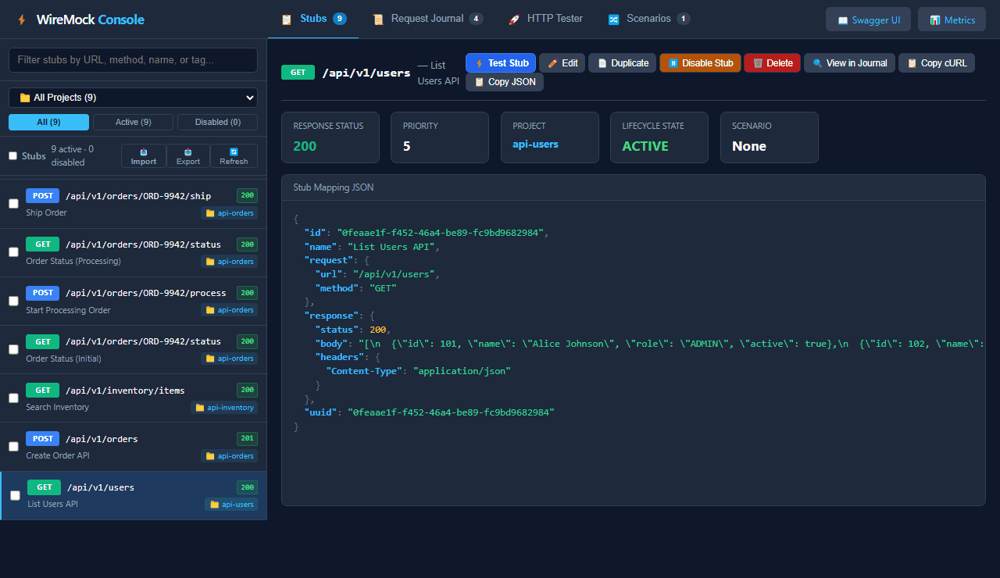
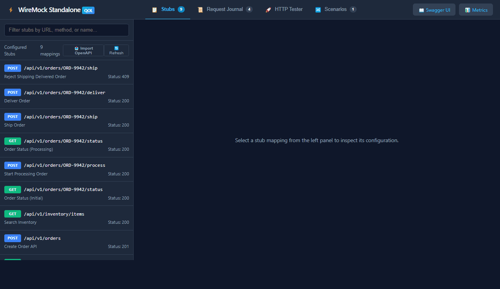
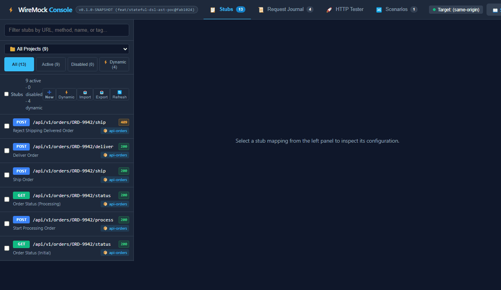

# WireMock Extensions Suite

A collection of lightweight, production-grade extensions for [WireMock](https://wiremock.org/) and WireMock Standalone.

> 📊 **Customer Pitch Deck**: View the interactive slide deck at [https://mattiasgreen.github.io/wiremock-extensions/pitch/](https://mattiasgreen.github.io/wiremock-extensions/pitch/) (or locally at `http://localhost:8080/__admin/ui/pitch/`).
>
> 🔍 **Retrospective & Roadmap**: See [retrospective.md](retrospective.md) for the architecture audit, failure mode analysis, and prioritized feature roadmap.

Each extension is **modular and standalone**: you can pick and choose only the extensions you need, or use the all-in-one bundle to include everything.

## Modules

| Module | Description | Documentation |
| :--- | :--- | :--- |
| **`wiremock-extension-json-logging`** | Single-line structured JSON logging for standard/verbose mode with automatic MDC header extraction (`x_correlation_id`, `x_tenant_id`). | [Module README](wiremock-extension-json-logging/README.md) |
| **`wiremock-extension-otel`** | In-process OpenTelemetry metrics recording (`wiremock_requests_total`, latency histogram) with a Prometheus scrape route (`/__admin/metrics/prometheus`). | [Module README](wiremock-extension-otel/README.md) |
| **`wiremock-extension-openapi`** | OpenAPI 3.0 / 3.1 specification parser and stub synthesizer with `POST /__admin/openapi/import` route and format-aware mock data generation. | [Module README](wiremock-extension-openapi/README.md) |
| **`wiremock-extension-stateful`** | In-memory dynamic stateful API simulation with type-safe Java DSL, 100% RCE-safe AST evaluation, and multi-tenant `X-Correlation-Id` isolation to prevent parallel test collision. | [Module README](wiremock-extension-stateful/README.md) |
| **`wiremock-extension-ui`** | Embedded WireMock Console web UI at `/__admin/ui/` with stub explorer, OpenAPI spec importer, scenario DAG state machine visualizer, request journal, and interactive HTTP tester (zero external dependencies). | [Module README](wiremock-extension-ui/README.md) |
| **`wiremock-extension-bundle`** | Umbrella module aggregating all extensions into a single JAR with unified SPI auto-discovery and a local dev runner. | [Module README](wiremock-extension-bundle/README.md) |
| **`wiremock-examples`** | Complete Case Management System reference implementation demonstrating stateful scenario modeling, parallel case collision pitfalls, best-practice isolated scenarios, and Playwright verification. | [Examples Subproject](wiremock-examples/README.md) |

## Quick Preview

| Overview Tour | OpenAPI Spec Import & Testing | Dynamic Stateful Simulation |
| :--- | :--- | :--- |
|  |  |  |

## Building

Prerequisites: Java 21+ and Gradle (wrapper included).

```bash
# Build all modules and run all tests
./gradlew build

# Build a specific extension module
./gradlew :wiremock-extension-json-logging:build
./gradlew :wiremock-extension-otel:build
./gradlew :wiremock-extension-openapi:build
./gradlew :wiremock-extension-ui:build
./gradlew :wiremock-extension-bundle:build

# Run all tests across the suite
./gradlew test
```

## Usage Options

### 1. All-in-One Bundle

If you want all extensions together, add `wiremock-extension-bundle` to your project or classpath:

**Gradle**:
```groovy
implementation 'io.github.mattiasgreen:wiremock-extension-bundle:0.1.0'
```

**WireMock Standalone CLI**:
```bash
java -cp "wiremock-extension-bundle-0.1.0.jar:wiremock-standalone-3.12.1.jar" \
  com.github.tomakehurst.wiremock.standalone.WireMockServerRunner \
  --port 8080 \
  --verbose
```

All extensions auto-register via Java Service Provider Interface (SPI):
- Web UI: `http://localhost:8080/__admin/ui/`
- Prometheus Metrics: `http://localhost:8080/__admin/metrics/prometheus`
- OpenAPI Spec Importer: `http://localhost:8080/__admin/openapi/import`
- Admin API: `http://localhost:8080/__admin/mappings`

### 2. Individual Extensions

Each extension can be used independently without pulling in the others:

- **JSON Logging Only**:
  ```groovy
  implementation 'io.github.mattiasgreen:wiremock-extension-json-logging:0.1.0'
  ```
  See [wiremock-extension-json-logging/README.md](wiremock-extension-json-logging/README.md) for details.

- **OpenTelemetry & Prometheus Only**:
  ```groovy
  implementation 'io.github.mattiasgreen:wiremock-extension-otel:0.1.0'
  ```
  See [wiremock-extension-otel/README.md](wiremock-extension-otel/README.md) for details.

- **Web UI Only**:
  ```groovy
  implementation 'io.github.mattiasgreen:wiremock-extension-ui:0.1.0'
  ```
  See [wiremock-extension-ui/README.md](wiremock-extension-ui/README.md) for details.

- **Dynamic Stateful Simulation Only**:
  ```groovy
  implementation 'io.github.mattiasgreen:wiremock-extension-stateful:0.1.0'
  ```
  See [wiremock-extension-stateful/README.md](wiremock-extension-stateful/README.md) for details.

### 3. Local Development Runner

To launch WireMock with all extensions and pre-loaded sample stubs for local testing:

```bash
./gradlew :wiremock-extension-bundle:runStandalone
```

The server starts on port `8080` with filesystem hot-reloading for UI development.

### 4. Live Proxy & Traffic Recording Testing (Dual-Server Setup)

To test the complete OpenAPI Live Proxying, Traffic Snapshot Recording, and Project Lifecycle workflow:

1. **Start the simulated Upstream Mock Service** (Port `8089`):
   ```bash
   ./gradlew :wiremock-extension-bundle:runUpstream
   ```
2. **Start the Primary WireMock Server with Extensions & UI** (Port `8080`):
   ```bash
   ./gradlew :wiremock-extension-bundle:runStandalone
   ```
3. **Open the WireMock Console UI**:
   Navigate to [http://localhost:8080/__admin/ui/](http://localhost:8080/__admin/ui/).
4. **Import OpenAPI Specification in Live Proxy Mode**:
   - Click **Import Spec / Bundle** in the top navigation.
   - Select **Live Proxy & Recording** mode.
   - Paste an OpenAPI specification containing an upstream path (e.g. `/api/v1/live-catalog`).
   - Set the Upstream Base URL to `http://localhost:8089` and set the Project Name to `Catalog Service`.
   - Click **Import as Live Proxies**.
5. **Live Test via HTTP Tester**:
   - Select the newly imported proxy stub (`[GET] /api/v1/live-catalog`).
   - Click **⚡ Test Stub** to load it into the HTTP Tester.
   - Click **Send Request**. The request is proxied through WireMock to the upstream service (`8089`) returning live upstream data!
6. **Snapshot Traffic into Disabled Stubs**:
   - Return to the **Stubs** tab and select the `Catalog Service` project filter.
   - The **Project Lifecycle Bar** displays `LIVE PROXY`.
   - Click **📷 Snapshot Live Traffic**. The proxied traffic from the Request Journal is captured and parked as a `DISABLED` stub.
   - Click the **Disabled Stubs** filter pill to inspect the captured authentic response.
7. **Switch to Stubs Mode & Go Offline**:
   - In the Project Lifecycle Bar, click **Switch to Stubs Mode**.
   - The project mode badge flips to `STUBS MODE` (proxy stubs are disabled, recorded stubs are activated).
   - Terminate the upstream service (Ctrl+C on port `8089`).
   - Re-send the request in the HTTP Tester: it is now served completely offline from the recorded stub!

### 5. Zero-Build Consumer Runner

You can run WireMock Standalone with the complete extension bundle loaded in any empty folder using a single minimal `build.gradle` file, without cloning or building this repository:

```groovy
plugins {
    id 'application'
}

repositories {
    mavenCentral()
}

dependencies {
    runtimeOnly 'org.wiremock:wiremock-standalone:3.12.1'
    runtimeOnly 'io.github.mattiasgreen:wiremock-extension-bundle:0.1.0'
}

application {
    mainClass = 'com.github.tomakehurst.wiremock.standalone.WireMockServerRunner'
}
```

Run with:
```bash
gradle run --args="--port 8080 --verbose"
```

Because all extensions implement `ExtensionFactory` via Java SPI, WireMock automatically discovers and loads the Web UI, metrics, and OpenAPI endpoints on startup.

### 6. Docker Reference Architecture

To deploy a containerized mock server with the extension bundle, you can assemble an image directly using published artifacts:

```dockerfile
FROM eclipse-temurin:21-jre-alpine
WORKDIR /wiremock

ARG WIREMOCK_VERSION=3.12.1
ARG BUNDLE_VERSION=0.1.0

RUN wget -q "https://repo1.maven.org/maven2/org/wiremock/wiremock-standalone/${WIREMOCK_VERSION}/wiremock-standalone-${WIREMOCK_VERSION}.jar" -O wiremock.jar \
 && wget -q "https://repo1.maven.org/maven2/io/github/mattiasgreen/wiremock-extension-bundle/${BUNDLE_VERSION}/wiremock-extension-bundle-${BUNDLE_VERSION}.jar" -O bundle.jar

EXPOSE 8080
ENTRYPOINT ["java", "-cp", "wiremock.jar:bundle.jar", "com.github.tomakehurst.wiremock.standalone.WireMockServerRunner", "--port", "8080"]
```

## Roadmap & Unified Simulator Stack

The suite is expanding into a **zero-sprawl Simulator Stack** running entirely in-process inside WireMock (sub-second startup, zero external container dependencies), alongside complete embedded control plane and stub lifecycle management.

> 📘 **Full Architecture Blueprint**: Read [docs/simulator-stack-architecture.md](docs/simulator-stack-architecture.md) for technical design details, and [retrospective.md](retrospective.md) for release phasing.

### 1. Multi-Protocol Simulator Stack Modules

* **🌪️ Network Chaos & Fault Injection (`wiremock-extension-chaos`)**:
  * Native re-implementation of Shopify's Toxiproxy in modern **Java 21 Virtual Threads** (`Thread.ofVirtual()`), running directly inside WireMock without external Go sidecars.
  * All 7 toxics supported: `latency` (with jitter), `bandwidth` throttling, `slow_close`, `timeout` (black hole), `reset_peer` (TCP RST via `setSoLinger(true,0)`), `slicer` (packet fragmentation), and `limit_data`.
  * Dual-layer control: L4 TCP Proxy with Toxiproxy v2 REST API compatibility (`POST /proxies/{name}/toxics`) + L7 WireMock HTTP chaos rules filtered by path, headers, or `X-Correlation-Id`.
  * Web UI Chaos controller with one-click presets ("3G Mobile", "Flaky Wi-Fi", "Chaos Monkey") and live drop counters.

* **📬 AsyncAPI & Event-Driven Mocking (`wiremock-extension-asyncapi`)**:
  * Ingest AsyncAPI 2.x and 3.x specifications (`asyncapi.yaml`) via `POST /__admin/asyncapi/import` and synthesize mock event publishers and schema payload generators.
  * Native WebSockets (`ws://...`) and Server-Sent Events (`GET /__async/channels/{name}` SSE) with zero external message broker containers.
  * In-memory Virtual Topic Broker supporting pub/sub channels, topic wildcards (`orders.*`), offset cursors, and consumer group simulation.
  * Bidirectional HTTP ⇄ Event triggers: automatically publish async events when HTTP endpoints are called, or fire webhooks when events are produced.

* **🪝 Asynchronous Callbacks & Webhooks (`wiremock-extension-webhooks`)**:
  * Automatic OpenAPI 3.0/3.1 `callbacks` parsing: synthesizes `202 Accepted` stubs paired with asynchronous webhook deliveries to dynamic URLs like `{{jsonPath request.body '$.callbackUrl'}}`.
  * Stateful workflow triggers: emit out-of-band callbacks upon state transitions in `wiremock-extension-stateful`.
  * Webhook Outbox Journal: UI audit log tracking dispatched callbacks, target endpoints, delivery status, retries, and an interactive "Trigger / Replay Now" button.

### 2. Embedded Control Plane & Web UI Authoring

* **Visual Stub Creator & Live Editor**:
  * Rich modal interface for authoring new stubs or editing existing mappings directly in the web UI without manual JSON authoring.
  * Visual builders for URL matchers (`urlEqualTo`, `urlPathMatching`, `urlPattern`), header/query parameter grids, and multi-mode response body editors (JSON, Raw text, base64 binary).
  * Direct synchronization with WireMock Admin API (`POST /__admin/mappings`, `PUT /__admin/mappings/{id}`) with instantaneous UI updates.
* **Bulk Stub Portfolio Management**:
  * One-Click Export: download all active mappings, scenarios, and dynamic models into a portable `stubs-bundle.json`.
  * Drag-and-Drop Bulk Import: upload stub bundles with conflict resolution strategies (Overwrite, Append, Skip).
  * State Snapshots & Checkpoints: save and restore named mock server checkpoints for deterministic, repeatable test suites.
* **Live Proxy Recording & Journal Promotion**:
  * Configure upstream reverse-proxy targets directly from the web console.
  * Smart recording filters by URL pattern, method, and headers with automated ID regex parameterization.
  * One-click promotion of any captured request in the Request Journal into a permanent stub mapping.

### 3. Advanced OpenAPI & Scenario Synthesis

* **State Machine & Scenario Inference**:
  * Infer WireMock scenario progressions from resource lifecycles (e.g., `POST /items` transitioning `Started` to `CREATED`, followed by `GET /items/{id}` and `DELETE /items/{id}`).
  * Support OpenAPI vendor extensions (`x-wiremock-scenario`, `x-wiremock-required-state`, `x-wiremock-new-state`, `x-wiremock-priority`).
* **Dynamic Response Templating & Realistic Data**:
  * Integrated Handlebars expressions (`{{request.path.[0]}}`, `{{now}}`, `{{randomValue type='UUID'}}`) directly inside synthesized OpenAPI responses.
  * Zero-dependency realistic mock data helpers (`{{random.email}}`, `{{random.name}}`, `{{random.creditCard}}`).

### 4. Enterprise Security & Networking

* [ ] **Configurable Outbound HTTPS Certificate Validation**: Support per-project and per-stub toggles to enforce strict upstream SSL/TLS certificate validation or configure custom truststores/CAs when proxying.
* [ ] **Dynamic Downstream Certificate Generation**: In-memory dynamic TLS certificate forging for arbitrary proxy hostnames in forward browser proxy mode.

## License

[Apache License 2.0](LICENSE)
