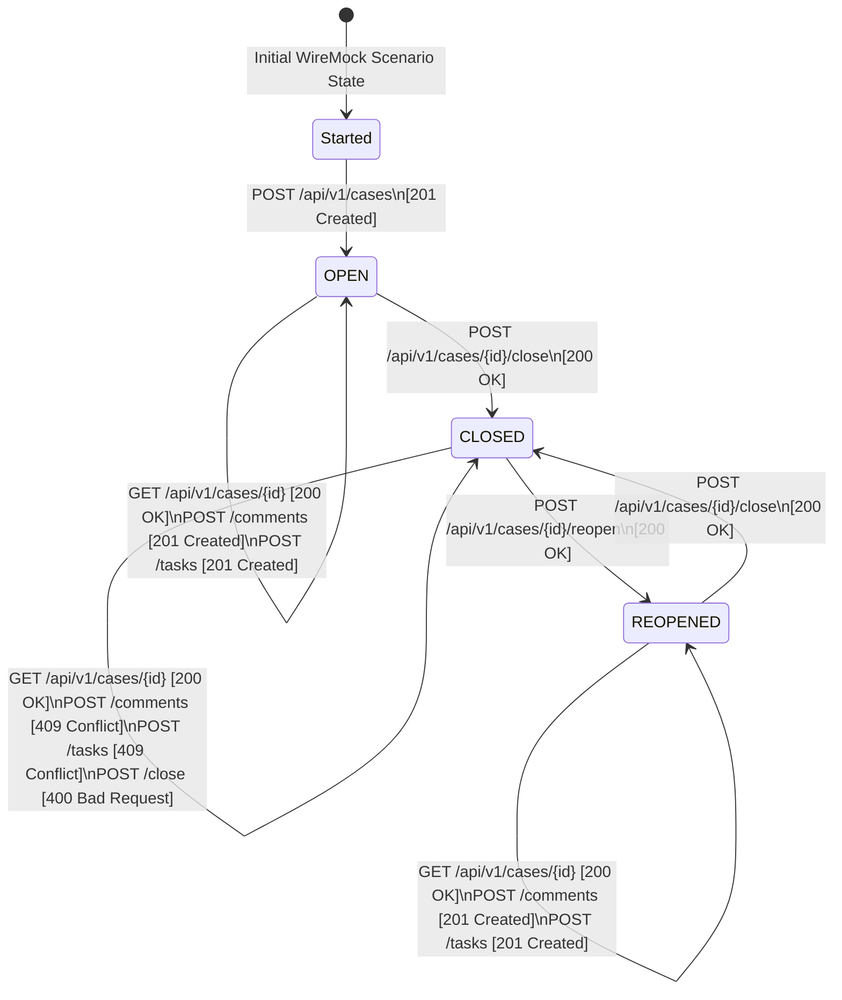

# WireMock Examples: Case Management System

A production-grade reference implementation demonstrating how to model, test, and debug stateful services using WireMock Scenarios, the Scenario DAG Visualizer, and Playwright.

## Domain Overview: Case Management System

The example models a stateful case lifecycle:
- **`Started`**: Entry state before a case is created.
- **`OPEN`**: Case is active. Allows reading case details, creating comments, and assigning tasks.
- **`CLOSED`**: Case has been resolved or closed. Rejects new comments and tasks with `409 Conflict`. Rejects repeated close requests with `400 Bad Request`.
- **`REOPENED`**: Case has been reopened. Allows comments and tasks again; can transition back to `CLOSED`.



## Key Components

1. **[`CaseClient`](src/main/java/com/github/mattiasgreen/wiremock/examples/casemanagement/CaseClient.java)**:
   - Typed Java 21 HTTP client built on `java.net.http.HttpClient` and Jackson.
   - Methods: `createCase()`, `getCase()`, `addComment()`, `addTask()`, `closeCase()`, `reopenCase()`.
   - Automatically raises typed `CaseConflictException` on 409 Conflict or 400 Bad Request.

2. **[`CaseLifecycleStubs`](src/main/java/com/github/mattiasgreen/wiremock/examples/casemanagement/CaseLifecycleStubs.java)**:
   - Configures WireMock stubs for the state machine.
   - Provides both a **Shared Scenario** setup (to expose out-of-the-box limitations) and an **Isolated Scenario** setup (best practice).

3. **[`CaseSystemIntegrationTest`](src/test/java/com/github/mattiasgreen/wiremock/examples/CaseSystemIntegrationTest.java)**:
   - **Single Case Happy Path & Invariants**: Tests the full state lifecycle, checking that comments and tasks are allowed in `OPEN`/`REOPENED` and strictly rejected in `CLOSED`.
   - **Parallel Cases Conundrum**: Demonstrates the global state collision pitfall where closing Case A inadvertently causes operations on concurrent Case B to fail with `409 Conflict`.
   - **Parallel Cases Solution**: Demonstrates best practice parameterization (`"CaseLifecycle-" + caseId`) ensuring complete test isolation without cross-test leakage.
   - **Request Journal Verification**: Uses `wireMockServer.verify(...)` to assert HTTP requests against the journal.
   - **Playwright DAG Visualizer**: Opens `/__admin/ui/#scenarios`, validates the interactive DAG visualizer, checks pipeline steps, and verifies real-time state synchronization when cases transition.

## Running the Examples

```bash
# Run the integration test suite
./gradlew :wiremock-examples:test
```
