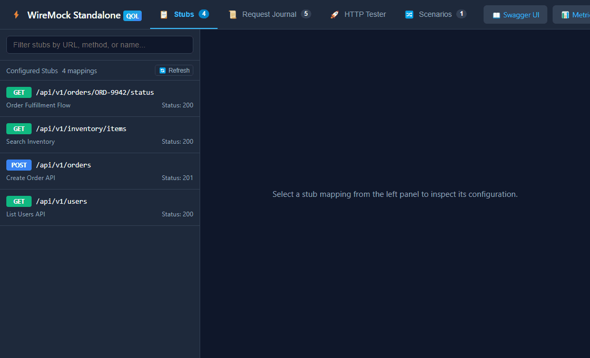
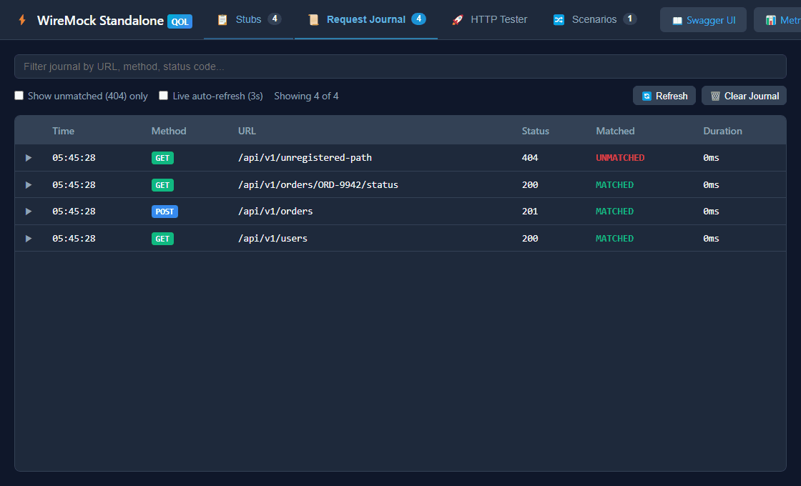
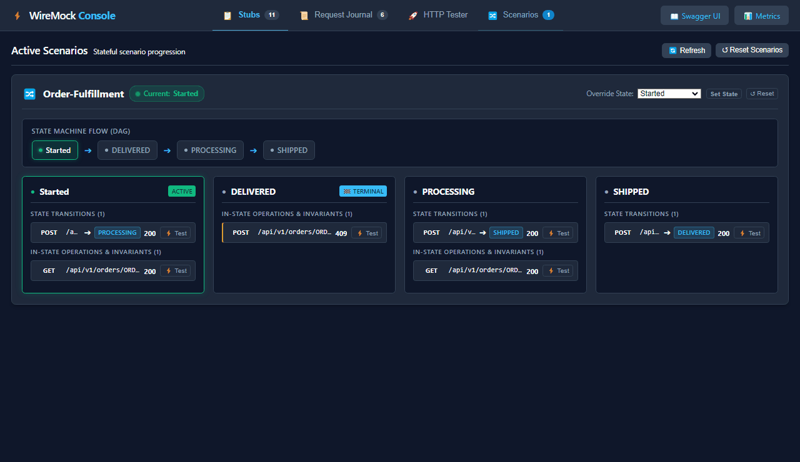

# WireMock Console (UI Extension)

A lightweight, self-contained web user interface for exploring stubs, inspecting the request journal, and testing HTTP endpoints directly from WireMock.

## Problem Statement

WireMock standalone exposes administration capabilities exclusively through raw JSON REST endpoints (`/__admin/mappings`, `/__admin/requests`). While scriptable, developers and QA engineers frequently need to:
- Visually browse, search, and inspect configured stubs and scenario states.
- Diagnose why an incoming request matched or failed to match a stub.
- Test and debug live HTTP requests against WireMock without switching to external tools like Postman or terminal curl commands.
- Share direct links to specific stubs, journal records, or test queries with teammates.

Most third-party UIs require external Node.js runtimes, Docker containers, or public CDN scripts that violate air-gapped security policies.

## How It Addresses the Problem

This extension embeds a pure vanilla ES6 Single-Page Application directly inside the JAR. It mounts seamlessly under WireMock's admin endpoint at `/__admin/ui/`.
- Zero external runtime or build dependencies (no npm, webpack, or CDNs required).
- Completely self-contained and safe for restricted/air-gapped networks.
- Full hash-based URL addressability so views, filters, stubs, and tester queries can be bookmarked and shared.


## Features

- **End-to-End OpenAPI Import & Testing Workflow**:
  - One-click import hub for OpenAPI 3.0 / 3.1 specifications (YAML or JSON) and WireMock bundles.
  - Choice between **Synthetic Stubs** (format-aware data generator) and **Live Transparent Proxy** (proxies requests to upstream live service with auto-discovered `servers:` block).
  - Direct handoff into the HTTP Tester with persistent Stubs Explorer on the left, request/response inspector, and collapsible vertical history sidebar.
  - Inspect live traffic matching and response verification in the Request Journal.

- **Live Proxy Recording & Project Lifecycle**:
  - Group stubs and proxies into distinct **Projects**.
  - **One-Click Snapshot Recording**: Record actual traffic forwarded to the upstream service directly from the request journal into captured stubs parked as `DISABLED` so they do not collide with active proxying.
  - **Project Mode Flip**: Toggle between **LIVE PROXY** mode and offline **STUBS MODE** in one click. Flipping to `STUBS MODE` disables the proxy stubs and activates the authentic recorded stubs, enabling 100% offline testing.


- **Stub Explorer, Lifecycle & Ad-Hoc Creation**:
  - Filter stubs instantly by HTTP method, URL pattern, stub name, project, or lifecycle state.
  - Create brand new stubs from scratch via `➕ New` without needing an OpenAPI spec or bundle.
  - Interactive editor modal to edit, duplicate, or inspect stub definitions with JSON formatting.
  - Seamless lifecycle management: edit both active and disabled stubs safely with zero 404 errors.
  - View full JSON mapping definitions with syntax highlighting (keys, strings, numbers, booleans, null, punctuation).
  - One-click copy for JSON stubs and generated `curl` commands.
  - **⚡ Test Stub** button transitions directly into the HTTP Tester with pre-populated URL, method, headers, and body while keeping the stubs sidebar visible.

- **Interactive HTTP Request Tester**:
  - Send requests directly to WireMock with custom methods, headers, and request bodies.
  - Full-height dual pane: Request Builder on the left, Response Inspector on the right (Response, Sent Request, or Both).
  - Dedicated collapsible vertical execution history sidebar with timestamps, status badges, response sizes, and one-click restoration.
  - Persistent header presets (`+ JSON`, `+ Bearer`, `+ Accept`) and JSON body formatter.



- **Request Journal Viewer**:
  - Search and filter recorded requests by method, URL, or matching status.
  - Expandable inline inspector showing request headers/body and corresponding response definition.
  - Highlights matched vs. unmatched status with visual badges.
  - Dedicated localized toolbar actions to refresh or clear the journal log.



- **Scenario DAG State Machine Visualizer**:
  - Automatic extraction of state machines and transitions across all configured stubs.
  - Interactive pipeline flow showing all stages (Started, in-progress states, terminal states).
  - Real-time active state glow indicator synchronized with live scenario progress.
  - State operations & rejection invariants inspector with one-click **⚡ Test** triggers.
  - Per-scenario targeted controls: override scenario state on the fly or reset individual scenarios to `Started`.



- **URL Addressability & Deep Linking**:
  - All tabs, selected stubs, journal details, and tester inputs synchronize with the URL hash (e.g. `#stubs?stubId=...`, `#tester?method=POST&url=...`).
- **Swagger UI Integration**:
  - Relative neighbor link to `../swagger-ui/` for environments where Swagger UI is co-hosted.
- **Developer Hot-Reloading**:
  - During local development, the endpoint detects local resources on disk and reloads HTML/CSS/JS without restarting the server.

## Usage

### Dependency Coordinates

**Gradle**:
```groovy
implementation 'io.github.mattiasgreen:wiremock-extension-ui:0.1.0'
```

**Maven**:
```xml
<dependency>
    <groupId>io.github.mattiasgreen</groupId>
    <artifactId>wiremock-extension-ui</artifactId>
    <version>0.1.0</version>
</dependency>
```

### Standalone CLI

Add the JAR to the classpath:

```bash
java -cp "wiremock-extension-ui-0.1.0.jar:wiremock-standalone-3.12.1.jar" \
  com.github.tomakehurst.wiremock.standalone.WireMockServerRunner \
  --port 8080
```

Open `http://localhost:8080/__admin/ui/` in your browser.

### Embedded Java

```java
import com.github.mattiasgreen.wiremock.ui.UiAdminApiEndpoint;
import com.github.tomakehurst.wiremock.WireMockServer;
import com.github.tomakehurst.wiremock.core.WireMockConfiguration;

WireMockServer wm = new WireMockServer(WireMockConfiguration.options()
    .port(8080)
    .extensions(new UiAdminApiEndpoint()));
wm.start();
```

When the JAR is on the classpath, the extension registers automatically via Java SPI.

## Build & Test

```bash
# Build JAR
./gradlew :wiremock-extension-ui:build

# Run Playwright UI integration tests (Chromium)
./gradlew :wiremock-extension-ui:test
```
